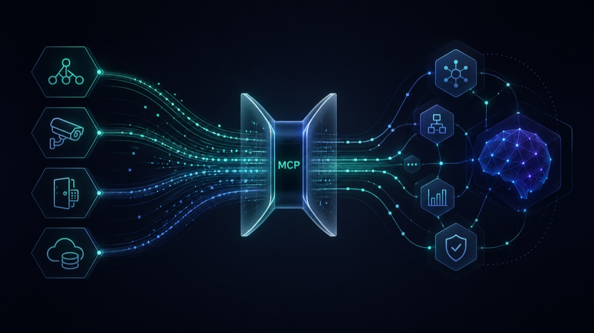

# UniFi MCP

<p align="center">
  
</p>

Leverage agents and agentic AI workflows to manage your UniFi deployment.

[](https://pypi.org/project/unifi-network-mcp/)
[](https://pypi.org/project/unifi-protect-mcp/)
[](https://pypi.org/project/unifi-access-mcp/)
[](https://pypi.org/project/unifi-mcp-relay/)
[](https://pypi.org/project/unifi-api-server/)
[](LICENSE)
[](https://www.python.org/downloads/)

## Servers

| Server | Status | Tools | Package |
|--------|--------|-------|---------|
| [Network](apps/network/) | Stable | 161 | [`unifi-network-mcp`](https://pypi.org/project/unifi-network-mcp/) |
| [Protect](apps/protect/) | Beta | 34 | [`unifi-protect-mcp`](https://pypi.org/project/unifi-protect-mcp/) |
| [Access](apps/access/) | Beta | 29 | [`unifi-access-mcp`](https://pypi.org/project/unifi-access-mcp/) |

## Cloud Relay

| Component | Status | Package |
|-----------|--------|---------|
| [Relay Sidecar](packages/unifi-mcp-relay/) | Beta | [`unifi-mcp-relay`](https://pypi.org/project/unifi-mcp-relay/) |
| [Worker Gateway](https://github.com/sirkirby/unifi-mcp-worker) | Beta | [`unifi-mcp-worker`](https://www.npmjs.com/package/unifi-mcp-worker) (CLI) |

The relay bridges your local MCP servers to a Cloudflare Worker, letting cloud agents access your UniFi tools without exposing local ports. Supports multi-location with annotation-based fan-out for read-only tools. Deploy the worker with `npm install -g unifi-mcp-worker && unifi-mcp-worker install`, then see the [relay README](packages/unifi-mcp-relay/) for connecting your local servers.

## REST + GraphQL API (non-MCP)

| Component | Status | Package |
|-----------|--------|---------|
| [API Server](apps/api/) | Beta (0.1.0) | [`unifi-api-server`](https://pypi.org/project/unifi-api-server/) · [GHCR image](https://github.com/sirkirby/unifi-mcp/pkgs/container/unifi-api-server) |

`unifi-api-server` is a standalone HTTP service exposing the same UniFi capabilities as the MCP servers, but as a REST + GraphQL API for desktop apps, dashboards, and any consumer that doesn't speak MCP. It runs **independently** of the MCP servers — both share the `unifi-core` manager packages, neither depends on the other being running. See [`apps/api/README.md`](apps/api/README.md) for quick-start and deployment patterns.

## What is this?

UniFi MCP is a collection of [Model Context Protocol](https://modelcontextprotocol.io/) servers that let AI assistants and automation tools interact with Ubiquiti UniFi controllers. Each server targets a specific UniFi application (Network, Protect, Access) and exposes its functionality as MCP tools — queryable, composable, and safe by default.

## Quick Start

### Claude Code (recommended)

Install via the plugin marketplace — includes the MCP server, an agent skill, and guided setup:

```
/plugin marketplace add sirkirby/unifi-mcp
/plugin install unifi-network@unifi-plugins
/unifi-network:setup
```

Repeat for Protect or Access if needed:
```
/plugin install unifi-protect@unifi-plugins
/plugin install unifi-access@unifi-plugins
```

Each plugin's `/setup` command walks you through connecting to your controller and configuring permissions.

### Other MCP clients

Run the servers directly:

```bash
uvx unifi-network-mcp@latest
uvx unifi-protect-mcp@latest
uvx unifi-access-mcp@latest
```

For Claude Desktop, add to your `claude_desktop_config.json`:

```jsonc
{
  "mcpServers": {
    "unifi-network": {
      "command": "uvx",
      "args": ["unifi-network-mcp@latest"],
      "env": {
        // Server-specific vars take priority; UNIFI_* is the fallback
        "UNIFI_NETWORK_HOST": "192.168.1.1",
        "UNIFI_NETWORK_USERNAME": "admin",
        "UNIFI_NETWORK_PASSWORD": "your-password"
      }
    },
    "unifi-protect": {
      "command": "uvx",
      "args": ["unifi-protect-mcp@latest"],
      "env": {
        "UNIFI_PROTECT_HOST": "192.168.1.1",
        "UNIFI_PROTECT_USERNAME": "admin",
        "UNIFI_PROTECT_PASSWORD": "your-password"
      }
    },
    "unifi-access": {
      "command": "uvx",
      "args": ["unifi-access-mcp@latest"],
      "env": {
        "UNIFI_ACCESS_HOST": "192.168.1.1",
        "UNIFI_ACCESS_USERNAME": "admin",
        "UNIFI_ACCESS_PASSWORD": "your-password"
      }
    }
  }
}
```

> **Tip:** If all servers connect to the same controller, you can use the shared `UNIFI_HOST` / `UNIFI_USERNAME` / `UNIFI_PASSWORD` variables instead of repeating them per server.

## Usage Examples

Once connected, just ask your AI agent in natural language:

**Network**
> "Show me all clients on the Guest VLAN with their signal strength and data usage"
> "Create a firewall rule that blocks IoT devices from reaching the internet between midnight and 6 AM"
> "Audit my firewall policies — are there any redundant or conflicting rules?"

**Protect**
> "List all cameras that detected motion in the last hour"
> "Show me smart detection events from the front door camera today — people and vehicles only"

**Access**
> "Who badged into the office today? Show me a timeline of all door access events"
> "Create a visitor pass for John Smith with access to the main entrance tomorrow 9-5"

**Cross-Product** (requires [relay](packages/unifi-mcp-relay/) for full experience)
> "Show me everything that happened at the front entrance in the last hour" — correlates Network clients, Protect camera events, and Access badge scans in a single timeline
> "A switch went offline at 2 AM — was there physical activity nearby?"

All mutations use a **preview-then-confirm** flow — you see exactly what will change before anything is applied.

## Configuration

Set these environment variables (or use a `.env` file):

| Variable | Required | Description |
|----------|----------|-------------|
| `UNIFI_HOST` | Yes | Controller IP or hostname |
| `UNIFI_USERNAME` | Yes | Local admin username |
| `UNIFI_PASSWORD` | Yes | Admin password |
| `UNIFI_API_KEY` | No | UniFi API key (experimental — limited to read-only, subset of tools) |

### Multi-controller setups

Each server supports its own prefixed environment variables that take priority over the shared `UNIFI_*` variables. This lets you point the Network and Protect servers at different controllers (or different credentials) while keeping a single `.env` file:

| Shared (fallback) | Network server | Protect server | Access server |
|--------------------|----------------|----------------|---------------|
| `UNIFI_HOST` | `UNIFI_NETWORK_HOST` | `UNIFI_PROTECT_HOST` | `UNIFI_ACCESS_HOST` |
| `UNIFI_USERNAME` | `UNIFI_NETWORK_USERNAME` | `UNIFI_PROTECT_USERNAME` | `UNIFI_ACCESS_USERNAME` |
| `UNIFI_PASSWORD` | `UNIFI_NETWORK_PASSWORD` | `UNIFI_PROTECT_PASSWORD` | `UNIFI_ACCESS_PASSWORD` |
| `UNIFI_PORT` | `UNIFI_NETWORK_PORT` | `UNIFI_PROTECT_PORT` | `UNIFI_ACCESS_PORT` |
| `UNIFI_VERIFY_SSL` | `UNIFI_NETWORK_VERIFY_SSL` | `UNIFI_PROTECT_VERIFY_SSL` | `UNIFI_ACCESS_VERIFY_SSL` |
| `UNIFI_API_KEY` | `UNIFI_NETWORK_API_KEY` | `UNIFI_PROTECT_API_KEY` | `UNIFI_ACCESS_API_KEY` |

**Single controller?** Just set the shared `UNIFI_*` variables -- all servers will use them. Server-specific variables are only needed when the servers talk to different controllers or use different credentials.

For the full configuration reference including permissions, transports, and advanced options, see the [Network server docs](apps/network/docs/configuration.md), [Protect server docs](apps/protect/docs/configuration.md), or [Access server docs](apps/access/docs/configuration.md).

## Agent Skills

Each plugin ships with agent skills that go beyond raw tool access — they teach agents how to perform common tasks effectively:

| Skill | Plugin | What it does |
|-------|--------|-------------|
| **Network Health Check** | unifi-network | Batch diagnostics across devices, health subsystems, and alarms with reference docs for interpreting results |
| **Firewall Manager** | unifi-network | Natural language firewall management with policy templates, config snapshots, and change tracking |
| **Firewall Auditor** | unifi-network | Security audit with 16 benchmarks, 100-point scoring, topology analysis, and trend tracking |
| **Security Digest** | unifi-protect | Cross-product event intelligence — summarizes camera, door, and network events with severity classification and correlation rules |
| **UniFi Access** | unifi-access | Door control, credentials, visitors, access policies — with real-time event streaming and activity summaries |

Skills include reference documentation (device states, alarm types, firewall schemas, event catalogs) and Python scripts for deterministic operations (auditing, config export/diff, template application).

## Architecture

This is a monorepo with shared packages:

```
apps/
  network/          # UniFi Network MCP server (stable, 166 tools)
  protect/          # UniFi Protect MCP server (beta, 38 tools)
  access/           # UniFi Access MCP server (beta, 29 tools)
packages/
  unifi-core/       # Shared UniFi connectivity (auth, detection, retry)
  unifi-mcp-shared/ # Shared MCP patterns (permissions, tools, diagnostics, config)
  unifi-mcp-relay/  # Cloud relay sidecar (bridges local servers to Cloudflare Worker)
plugins/
  unifi-network/    # Claude Code plugin: MCP server + agent skills + setup
  unifi-protect/    # Claude Code plugin: MCP server + agent skills + setup
  unifi-access/     # Claude Code plugin: MCP server + setup
skills/
  _shared/          # Shared utilities for skill scripts (MCP client, config)
docs/               # Ecosystem-level documentation
```

Each server in `apps/` is an independent Python package that depends on the shared packages. The shared packages ensure consistent behavior across all servers — same permission model, same confirmation flow, same lazy tool loading.

See [docs/ARCHITECTURE.md](docs/ARCHITECTURE.md) for details.

## Contributing

See [CONTRIBUTING.md](CONTRIBUTING.md) for the development workflow, including how to work with the monorepo, run tests, and submit PRs.

## License

[MIT](LICENSE)
