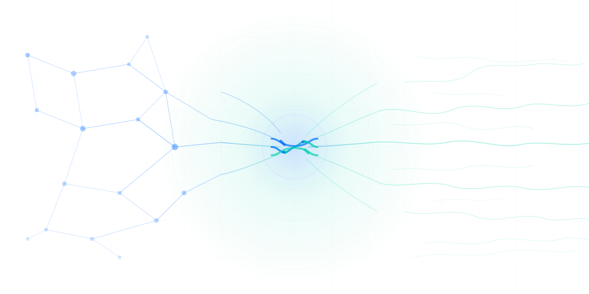

# UniFi MCP

<p align="center">
  
</p>

Leverage agents and agentic AI workflows to manage your UniFi deployment.

[](https://pypi.org/project/unifi-network-mcp/)
[](https://pypi.org/project/unifi-protect-mcp/)
[](https://pypi.org/project/unifi-access-mcp/)
[](LICENSE)
[](https://www.python.org/downloads/)

## Servers

| Server | Status | Tools | Package |
|--------|--------|-------|---------|
| [Network](apps/network/) | Stable | 91 | [`unifi-network-mcp`](https://pypi.org/project/unifi-network-mcp/) |
| [Protect](apps/protect/) | Beta | 34 | [`unifi-protect-mcp`](https://pypi.org/project/unifi-protect-mcp/) |
| [Access](apps/access/) | Beta | 29 | [`unifi-access-mcp`](https://pypi.org/project/unifi-access-mcp/) |

## What is this?

UniFi MCP is a collection of [Model Context Protocol](https://modelcontextprotocol.io/) servers that let AI assistants and automation tools interact with Ubiquiti UniFi controllers. Each server targets a specific UniFi application (Network, Protect, Access) and exposes its functionality as MCP tools — queryable, composable, and safe by default.

## Quick Start

### Claude Code (recommended)

Install via the plugin marketplace — includes the MCP server, an agent skill, and guided setup:

```
/plugin marketplace add sirkirby/unifi-mcp
/plugin install unifi-network@unifi-plugins
/unifi-network:setup
```

Repeat for Protect or Access if needed:
```
/plugin install unifi-protect@unifi-plugins
/plugin install unifi-access@unifi-plugins
```

Each plugin's `/setup` command walks you through connecting to your controller and configuring permissions.

### Other MCP clients

Run the servers directly:

```bash
uvx unifi-network-mcp
uvx unifi-protect-mcp
uvx unifi-access-mcp
```

For Claude Desktop, add to your `claude_desktop_config.json`:

```jsonc
{
  "mcpServers": {
    "unifi-network": {
      "command": "uvx",
      "args": ["unifi-network-mcp"],
      "env": {
        // Server-specific vars take priority; UNIFI_* is the fallback
        "UNIFI_NETWORK_HOST": "192.168.1.1",
        "UNIFI_NETWORK_USERNAME": "admin",
        "UNIFI_NETWORK_PASSWORD": "your-password"
      }
    },
    "unifi-protect": {
      "command": "uvx",
      "args": ["unifi-protect-mcp"],
      "env": {
        "UNIFI_PROTECT_HOST": "192.168.1.1",
        "UNIFI_PROTECT_USERNAME": "admin",
        "UNIFI_PROTECT_PASSWORD": "your-password"
      }
    },
    "unifi-access": {
      "command": "uvx",
      "args": ["unifi-access-mcp"],
      "env": {
        "UNIFI_ACCESS_HOST": "192.168.1.1",
        "UNIFI_ACCESS_USERNAME": "admin",
        "UNIFI_ACCESS_PASSWORD": "your-password"
      }
    }
  }
}
```

> **Tip:** If all servers connect to the same controller, you can use the shared `UNIFI_HOST` / `UNIFI_USERNAME` / `UNIFI_PASSWORD` variables instead of repeating them per server.

## Configuration

Set these environment variables (or use a `.env` file):

| Variable | Required | Description |
|----------|----------|-------------|
| `UNIFI_HOST` | Yes | Controller IP or hostname |
| `UNIFI_USERNAME` | Yes | Local admin username |
| `UNIFI_PASSWORD` | Yes | Admin password |
| `UNIFI_API_KEY` | No | UniFi API key (experimental — limited to read-only, subset of tools) |

### Multi-controller setups

Each server supports its own prefixed environment variables that take priority over the shared `UNIFI_*` variables. This lets you point the Network and Protect servers at different controllers (or different credentials) while keeping a single `.env` file:

| Shared (fallback) | Network server | Protect server | Access server |
|--------------------|----------------|----------------|---------------|
| `UNIFI_HOST` | `UNIFI_NETWORK_HOST` | `UNIFI_PROTECT_HOST` | `UNIFI_ACCESS_HOST` |
| `UNIFI_USERNAME` | `UNIFI_NETWORK_USERNAME` | `UNIFI_PROTECT_USERNAME` | `UNIFI_ACCESS_USERNAME` |
| `UNIFI_PASSWORD` | `UNIFI_NETWORK_PASSWORD` | `UNIFI_PROTECT_PASSWORD` | `UNIFI_ACCESS_PASSWORD` |
| `UNIFI_PORT` | `UNIFI_NETWORK_PORT` | `UNIFI_PROTECT_PORT` | `UNIFI_ACCESS_PORT` |
| `UNIFI_VERIFY_SSL` | `UNIFI_NETWORK_VERIFY_SSL` | `UNIFI_PROTECT_VERIFY_SSL` | `UNIFI_ACCESS_VERIFY_SSL` |
| `UNIFI_API_KEY` | `UNIFI_NETWORK_API_KEY` | `UNIFI_PROTECT_API_KEY` | `UNIFI_ACCESS_API_KEY` |

**Single controller?** Just set the shared `UNIFI_*` variables -- all servers will use them. Server-specific variables are only needed when the servers talk to different controllers or use different credentials.

For the full configuration reference including permissions, transports, and advanced options, see the [Network server docs](apps/network/docs/configuration.md), [Protect server docs](apps/protect/docs/configuration.md), or [Access server docs](apps/access/docs/configuration.md).

## Architecture

This is a monorepo with shared packages:

```
apps/
  network/          # UniFi Network MCP server (stable, 91 tools)
  protect/          # UniFi Protect MCP server (beta, 34 tools)
  access/           # UniFi Access MCP server (beta, 29 tools)
packages/
  unifi-core/       # Shared UniFi connectivity (auth, detection, retry)
  unifi-mcp-shared/ # Shared MCP patterns (permissions, tools, diagnostics, config)
docs/               # Ecosystem-level documentation
```

Each server in `apps/` is an independent Python package that depends on the shared packages. The shared packages ensure consistent behavior across all servers — same permission model, same confirmation flow, same lazy tool loading.

See [docs/ARCHITECTURE.md](docs/ARCHITECTURE.md) for details.

## Contributing

See [CONTRIBUTING.md](CONTRIBUTING.md) for the development workflow, including how to work with the monorepo, run tests, and submit PRs.

## License

[MIT](LICENSE)
